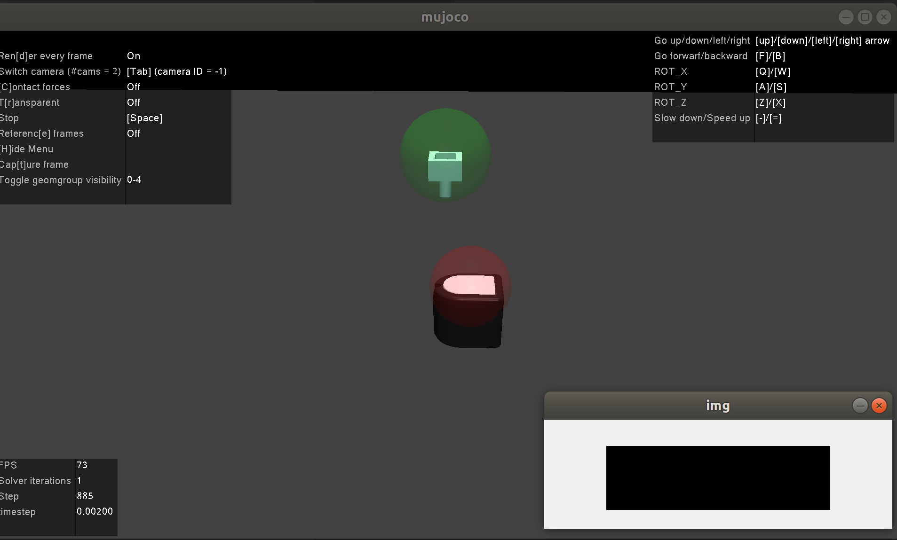

# FOTS-mujoco: An example of FOTS simulation model in MuJoCo

This branch is an integrated MuJoCo simulation example with FOTS. It is adapted from [GelSightMujoco](https://github.com/rlamprell/GelSightMujoco) and [mocap-control](https://github.com/kevincheng3/mocap-control) repo.

## Installation
To install dependencies:

```
pip install -r requirements.txt
```

## Usage
First, to achieve simultaneous onscreen and offscreen rendering in MuJoCo, you should replace `gym/envs/mujoco/mujoco_rendering.py` file using the same name file in this repo.

Then, run `python env_test.py`, there will be a [MuJoCo] window and a [img] window as following. You can control object to move in [MuJoCo] window through keyboard, or press `g` to generate simulated tactile image and tactile flow **after switching to [img] window.**



## Operating System
The code has been tested on Ubuntu.